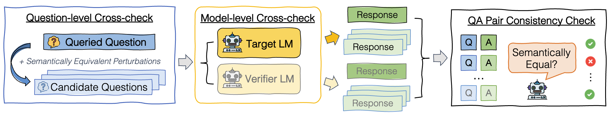

[](#python)
[](https://raw.githubusercontent.com/intuit/email-decomposer/master/LICENSE)
[](https://github.com/psf/black)


# SAC$`^3`$: Reliable Hallucination Detection in Black-Box Language Models via Semantic-aware Cross-check Consistency


## :fire: News

- [2023.11] SAC$`^3`$ code is released.
- [2023.10] SAC$`^3`$ paper is accepted and to appear at EMNLP 2023.


## 🤔 What is SAC$`^3`$

Semantic-aware cross-check consistency (SAC$`^3`$) is a novel sampling-based hallucination detection method that expands on the principle of self-consistency checking and incorporates additional mechanisms to detect both question-level and model-level hallucinations by leveraging advances including semantically equivalent question perturbation and cross-model response consistency checking. 




## 🤖 Installation

SAC$`^3`$ requires **Python version >= 3.8**. It can be installed from pip (coming soon!):

```bash
pip install sac3
```


## 🚀 Quickstart
The easiest way to start playing is
1. [```Jupyter Notebook```](notebook/quick_start.ipynb)
2. Google Colab (coming soon)


## 📃 Usage

### Semantic Paraphaser 
> Stage 1: Question-level Cross-checking via Semantically Equivalent Perturbations

``` python
from sac3 import paraphraser

# input information - user question and target answer 
question = 'is 3691 a prime number?'
target_answer = 'No, it is not a prime number'

# question pertubations
gen_question = paraphraser.paraphrase(question, number = 5, model = 'gpt-3.5-turbo', temperature=1.0)

```
The output is 
``` 
gen_question = ['1. Can 3691 only be divided by 1 and itself?',
 '2. Are there any factors of 3691 other than 1 and itself?',
 '3. Does 3691 belong to the set of prime numbers?',
 '4. Is 3691 indivisible except by 1 and itself?',
 '5. Is 3691 not evenly divisible by any number other than 1 and itself?']

```
### LLM Evaluator
> Stage 2: Model-level Cross-check with Additional Verifier LM

```python
from sac3.evaluator import Evaluate

# call target model, e.g., gpt-3.5 or gpt-4
llm_evaluate = Evaluate(model='gpt-3.5-turbo')

# sampled multiple responses given the original question 
self_responses = llm_evaluate.self_evaluate(self_question = question, temperature = 1.0, self_num = 5)

# sampled multiple responses given perturbed question
perb_responses = llm_evaluate.perb_evaluate(perb_question = gen_question, temperature=0.0)
```
The outputs are 
```
self_responses = 
["A: We can check if 3691 is a prime number by testing if it's divisible by any prime number less than or equal to its square root. \n\nThe square root of 3691 is approximately 60.77, so we only need to check if it's divisible by prime numbers less than or equal to 60. \n\nWe can quickly eliminate even numbers, since 3691 is odd. \n\nDivisibility by 3:\n3 + 6 + 9 + 1 = 19, which is not divisible by 3. Therefore, 3691 is not divisible by 3. \n\nDivisibility by 5:\n3691 does not end in 5 or 0, so it's not divisible by 5. \n\nDivisibility by 7:\nTo check if 3691 is divisible by 7, we can take the last digit (1) and double it, then subtract that result from the remaining digits (369 - 2 = 367). We can continue this process until we get a number we know the divisibility of. \n\n36 - 2*1 = 34\n3 - 2*4 = -5\n\nSince -5 is not divisible by 7, neither is 3691. \n\nWe can continue checking for divisibility by other prime numbers, but it's clear that 3691 is not divisible by any primes less than or equal to 60. Therefore, 3691 is a prime number.",
 'Yes, 3691 is a prime number.',
 'A: Yes, 3691 is a prime number.',
 'No, 3691 is not a prime number. It is divisible by 7 and 17.',
 'A: Yes, 3691 is a prime number.']
```
```
perb_responses = 
['As an AI language model, I can say that 3691 can only be divided by 1 and itself, as it is a prime number.',
 'As an AI language model, I do not have the ability to manually factorize numbers. However, I can tell you that if there are any factors of 3691 other than 1 and itself, then 3691 would not be a prime number.',
 'A: No, 3691 is not a prime number as it is divisible by 7 and 527.',
 'A: Yes, 3691 is indivisible except by 1 and itself, making it a prime number.',
 'As an AI language model, I can calculate that 3691 is not evenly divisible by any number other than 1 and itself. Therefore, it is a prime number.']
 ```
### Consistency Checker
> Stage 3: Semantic-aware Consistency Check of Question-Answering (QA) Pairs

-  Self-checking Consistency (SC$`^2`$) Score
```python
from sac3.consistency_checker import SemanticConsistnecyCheck

# call LLM to evaluate if the sampled responses are semantically equivalent to the target answer
scc = SemanticConsistnecyCheck(model='gpt-3.5-turbo')

# self consistency check 
sc2_score, sc2_vote = scc.score_scc(question, target_answer, candidate_answer = self_responses, temperature = 0.0)
print(sc2_score, sc2_vote)
```
The output is 
```
0.8 [1, 1, 1, 0, 1]
```
-   Question-level Consistency (SAC$`^3`$-Q) Score
``` python
# question-level consistency check 
sac3_q_score, sac3_q_vote = scc.score_scc(question, target_answer, candidate_answer = perb_responses, temperature = 0.0)
print(sac3_q_score, sac3_q_vote)
```
The output is 
```
0.6 [1, 0, 0, 1, 1]
```

## 💁Citation 

```
@inproceedings{zhang2023sac3,
      title={SAC^3: Reliable Hallucination Detection in Black-Box Language Models via Semantic-aware Cross-check Consistency},
      author={Jiaxin Zhang, Zhuohang Li, Kamalika Das, Bradley Malin, Sricharan Kumar},
      booktitle={EMNLP},
      year={2023}
}
```


<!-- ## How to use
### Install 
(TODO: publish to pip)
```
pip install dcr-consistency
```
### Import
```
from dcr.evaluator import evaluate
from dcr.improver import improve
```

### Usage
#### Evaluation
```
res = evaluate(_your_LLM_, _your_model_config_, data, worker_count=5)
```
The `data` depends on the prompt used. By default each item should be a dict containting fields `id`, `reference` and `candidate`. The returned item will be the original data passed in joined with the columns below:

| column  | meaning   |
|-------------|:------------|
|  id | Unique Identifier for each row | 
|  score | Final consistency score of the row | 
| dce_reasons | Reaons for the final score given by DCE| 
| amc_reasons | Reaons for scoring of each sentence given by AMC | 
|  dce_raw | Raw data from DCE | 
| amc_raw | Raw data from AMC | 
|  decision | Consistency decision based on DCE | 

#### Inconsitency Mitigation
```
res = improve(_your_LLM_, _your_model_config_, data, worker_count=5)
```

The `data` depends on the prompt used. By default each item should be a dict containting fields `id`, `article` and `sentences`. `article` is the reference. `sentences` is a list illustrating whether each sentence is or is not consistent compared to the reference and the reasons. The returned item will be the original data passed in joined with the columns below:

| column  | meaning   |
|-------------|:------------|
|  id | Unique Identifier for each row | 
|  improved_version | The improved version where inconsistency is mitigated | 
| rai_raw | Raw data from RAI| 

### Contributing

(TODO: update link once correct repo is created)
See [CONTRIBUTING.md](https://github.com/intuit/to_be_created/blob/main/CONTRIBUTING.md). -->